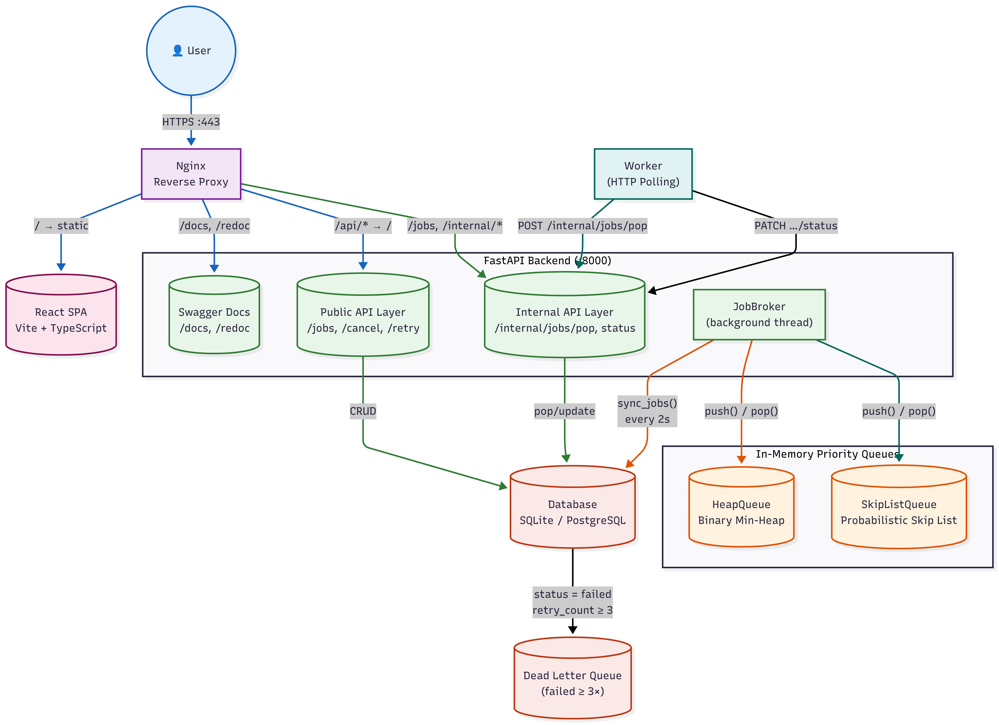
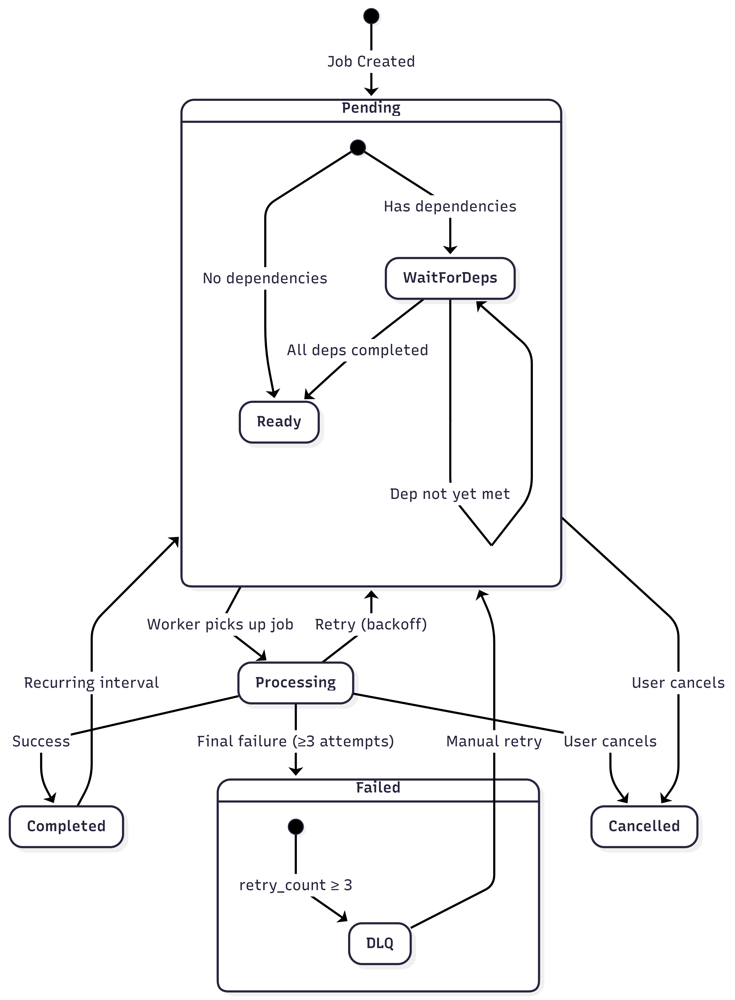

# Dilamme Job Scheduler — Architecture

## System Overview

The Dilamme Job Scheduler is a background job processing system with priority queuing, scheduling, retry with exponential backoff, dead letter queue (DLQ), dependency resolution, starvation prevention, and recurring job support.

```
                    ┌──────────────────────────────────────────────────────────┐
                    │                     Internet                            │
                    └──────────┬───────────────────────────────────┬───────────┘
                               │                                   │
                     HTTPS :443                              HTTPS :443
                     https://dilamme.viewdns.net/             https://dilamme.viewdns.net/docs
                               │                                   │
                    ┌──────────▼───────────────────────────────────▼───────────┐
                    │                        Nginx                             │
                    │                   (Reverse Proxy)                        │
                    │  ┌──────────────┐  ┌──────────────┐  ┌────────────────┐  │
                    │  │ location /   │  │ location ~   │  │ location /api/ │  │
                    │  │ (static FE)  │  │^/(docs|redoc │  │ (rewrite → /)  │  │
                    │  │              │  │  |openapi..)  │  │                │  │
                    │  └──────┬───────┘  └──────┬───────┘  └───────┬────────┘  │
                    └─────────┼─────────────────┼──────────────────┼────────────┘
                              │                 │                  │
                              ▼                 ▼                  ▼
                    ┌─────────────────┐  ┌───────────────────────────────┐
                    │   Static Files  │  │       FastAPI Backend         │
                    │  frontend/dist/ │  │   (uvicorn :8000)             │
                    │   React SPA     │  │                               │
                    │                 │  │  ┌─────────────────────────┐  │
                    │                 │  │  │  Public API             │  │
                    │                 │  │  │  POST /jobs             │  │
                    │                 │  │  │  GET  /jobs             │  │
                    │                 │  │  │  POST /jobs/{id}/cancel │  │
                    │                 │  │  │  POST /jobs/{id}/retry  │  │
                    │                 │  │  ├─────────────────────────┤  │
                    │                 │  │  │  Internal API           │  │
                    │                 │  │  │  POST /internal/jobs/pop│  │
                    │                 │  │  │  PATCH /internal/jobs/  │  │
                    │                 │  │  │    {id}/status          │  │
                    │                 │  │  ├─────────────────────────┤  │
                    │                 │  │  │  Swagger Docs           │  │
                    │                 │  │  │  /docs  (Swagger UI)    │  │
                    │                 │  │  │  /redoc (ReDoc UI)      │  │
                    │                 │  │  │  /openapi.json (schema) │  │
                    │                 │  │  └─────────────────────────┘  │
                    └─────────────────┘  └──────────────┬────────────────┘
                                                         │
                                                         │ SQLAlchemy ORM
                                                         │
                                              ┌──────────▼──────────┐
                                              │     Database        │
                                              │  (SQLite / PG)      │
                                              │                     │
                                              │  ┌───────────────┐  │
                                              │  │ jobs          │  │
                                              │  │ job_logs      │  │
                                              │  │ job_deps      │  │
                                              │  └───────────────┘  │
                                              └─────────────────────┘
```

## Component Architecture




## Data Flow

### Job Lifecycle



### Detailed Flow Sequence


## Key Design Decisions

| Decision | Choice | Rationale |
|----------|--------|-----------|
| **Priority Queue** | Binary Heap (default) / Skip List | O(log n) push/pop; Skip List offers better concurrent performance |
| **Worker model** | HTTP polling from API | Simple, stateless workers; no message broker dependency |
| **Retry strategy** | Exponential backoff with jitter | `backoff = 5^retry ± 20%`; prevents thundering herd |
| **DLQ threshold** | 3 failed attempts | Configurable; triggers alert at 10+ DLQ items |
| **Starvation prevention** | Priority bump after 5 min idle | Low-priority jobs eventually execute |
| **Stuck job recovery** | 10 min processing timeout | Crashed workers don't block the queue |
| **Database** | SQLite (dev) / PostgreSQL (prod) | SQLAlchemy abstraction makes switching trivial |
| **API docs** | FastAPI auto-generated Swagger/ReDoc | Zero-maintenance OpenAPI 3.0 documentation |

## Deployment Architecture

```
┌──────────┐     ┌──────────┐     ┌──────────┐
│  Oracle  │     │  Nginx   │     │ Systemd  │
│  Cloud   │────▶│  :443    │────▶│ Services │
│  Free TX │     │  HTTPS   │     │          │
└──────────┘     └──────────┘     ├──────────┤
                                  │scheduler-│
  Domain:                          │api.service│
  dilamme.viewdns.net              ├──────────┤
                                  │scheduler-│
                                  │worker.svc │
                                  └──────────┘
```

## URLs (Production)

| URL | Purpose |
|-----|---------|
| `https://dilamme.viewdns.net/` | Frontend SPA Dashboard |
| `https://dilamme.viewdns.net/docs` | Swagger UI (API docs) |
| `https://dilamme.viewdns.net/redoc` | ReDoc (alternative API docs) |
| `https://dilamme.viewdns.net/openapi.json` | OpenAPI 3.0 schema |
| `https://dilamme.viewdns.net/api/jobs` | API endpoint (via Nginx proxy) |

## Nginx Routing

| Path | Target | Handler |
|------|--------|---------|
| `/` | Static files | `frontend/dist/` |
| `/docs` | FastAPI Swagger | Proxy → `:8000` |
| `/redoc` | FastAPI ReDoc | Proxy → `:8000` |
| `/openapi.json` | OpenAPI schema | Proxy → `:8000` |
| `/api/*` → `/*` | Backend API | Proxy → `:8000` |
| `/jobs`, `/internal/*` | Backend API | Proxy → `:8000` |
